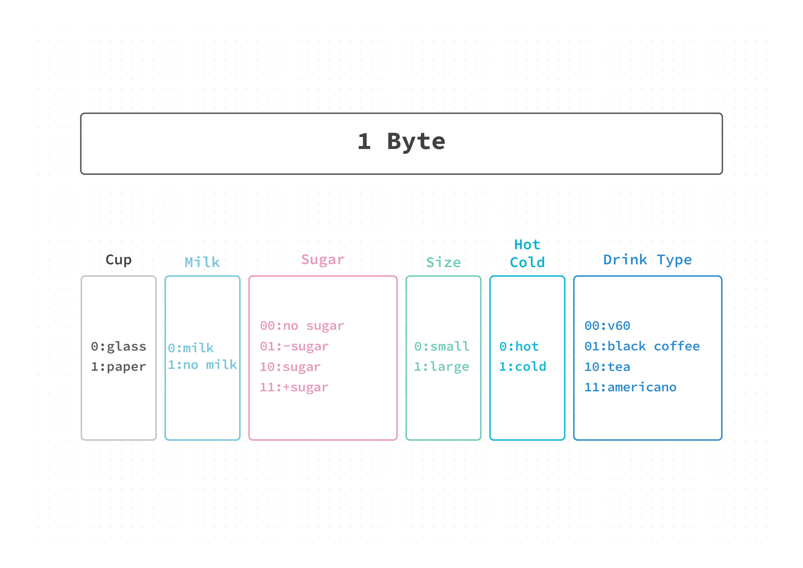

# Project 01
A bit-level simulation of a coffee machine that generates drinks based on a single byte.

## Overview 
This project demonstrates how a single byte (8 bits) can represent multiple configurations in a system. Instead of focusing on a specific programming language, this project focuses on low-level thinking, which explains how data can be encoded and interpreted at the bit level.

The application simulates a coffee machine where each bit in a byte controls a specific drink property.

## Concept

A single byte (8 bits) is divided into segments, where each segment represents a drink attribute:

- Cup type
- Milk
- Sugar
- Size
- Temperature (Hot/Cold)
- Drink type


## Byte Structure

### Byte Structure



### How It Works
- User inputs a number between 0 and 255
- The number is converted to 8-bit binary
- Each bit segment is decoded into drink attributes
- The final drink is generated
## Example
Input
```
77
```
Binary
```
01001101
```
Output
```
glass cup - milk - no sugar - large - cold - black coffee 
```
