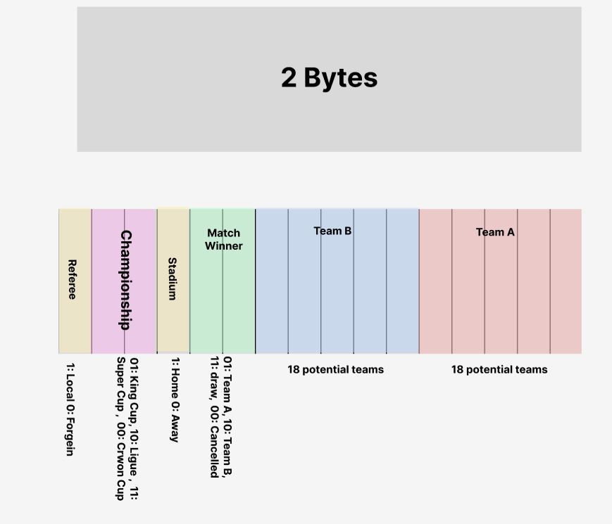

# Project 02
A bit-level simulation of Saudi local football matches using a 16-bit word (2 bytes) to encode match details.

## Overview 
This project demonstrates how 2 bytes (16 bits) can represent a complete system configuration. It emphasizes low-level data representation, on how structured information (like a football match) can be encoded and decoded using binary.

The application simulates a football match where each group of bits defines a specific match attribute.

## Concept

A 16-bit word is divided into segments, where each segment represents a match property:

- Team A
- Team B
- Match Winner
- Stadium
- Championship
- Referee

Each input value is decoded into a full match description.


### Byte Structure



### How It Works
- User inputs a 4-digit hexadecimal number 
- The number is converted to 16-bit binary
- Each bit segment is decoded into the match property
- The Match result is generated


## Example
Input
```
3E7C
```
Binary
```
0011 1110 0111 1100
```
Output
```
Al-Etifag Team against Al-qadisiah Team on alqadisiah stadium alqadisiah win on King Cup forgein refree
```

<!-- foreign refree - King Cup - Home - Draw --> 
