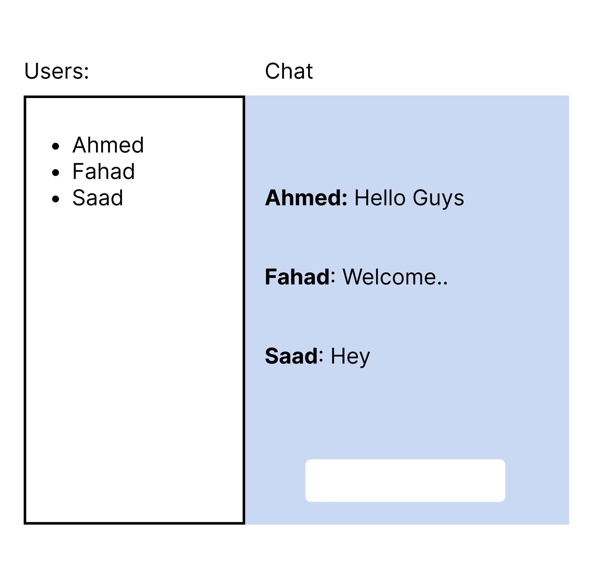

# Chat Application Project

## Overview
This project focuses on network programming, with the main goal of building a chat application using a **client-server architecture**. Built in C, the application uses the socket interface and system calls to facilitate communication, using the terminal as the user interface.

### Terminal Structure

